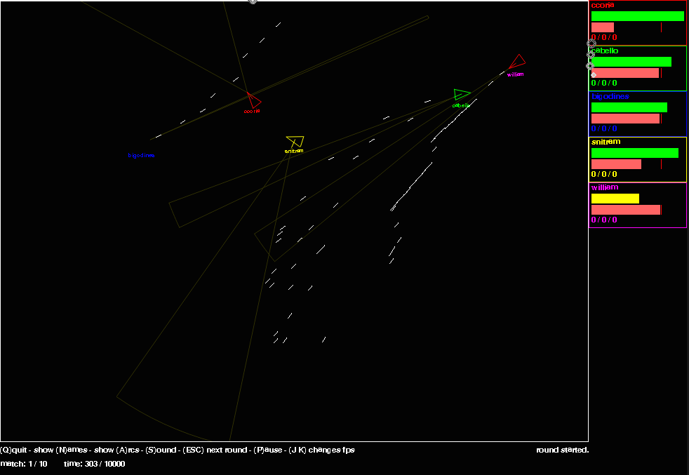

# Pythonbots



PythonBots is a programming contest where programmers, or players, write robots
in python to fight in a virtual arena. Wins the robot who stand alive last, the
objective is to kill all opponents shooting them.

The programming is very easy, thanks to python itself and to a very simple
interface. The player has only to create one python file(module) with only on
function that takes input parameters read from the world and output decisions
like moving, turning or shooting. There are some examples.

The graphics are not very fancy, using pygame and only simple drawing
primitives. But yet the game its very exciting and fun, even though all you do
after programming your bot is watch it trying to beat your friends.

It's possible to configure several matches for championships and also run it
without graphics for fastest results. 

## Command line usage

```console
Usage: main.py [options]

Options:
  -h, --help            show this help message and exit
  -d DT, --dt=DT        delay per frame(fps related)
  -r ROUNDS, --rounds=ROUNDS
                        rounds to play
  -a, --arcs            Show scan arcs
  -s, --sound           Active sound effects
  -t, --text-mode       Text mode(no graphics): faster simulation
  -n, --names           Show bot names
```console

### Example

```console
$ python main.py -ans -r 10 ccoria cabello bigodines snitram william
```

